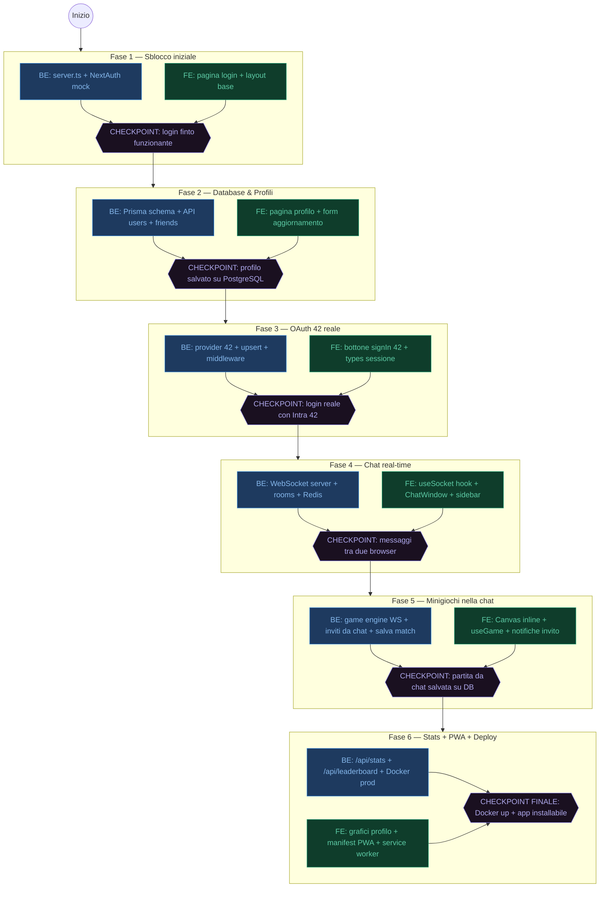

```mermaid
graph TD
    classDef be fill:#1e3a5f,stroke:#378ADD,color:#85B7EB
    classDef fe fill:#0f3d2b,stroke:#1D9E75,color:#5DCAA5
    classDef cp fill:#1a1020,stroke:#7F77DD,color:#AFA9EC

    Start((Inizio)) --> F1

    subgraph F1 [Fase 1 — Sblocco iniziale]
        B1[BE: server.ts + NextAuth mock]:::be
        F1A[FE: pagina login + layout base]:::fe
        B1 & F1A --> C1{{CHECKPOINT: login finto funzionante}}:::cp
    end

    C1 --> F2

    subgraph F2 [Fase 2 — Database & Profili]
        B2[BE: Prisma schema + API users + friends]:::be
        F2A[FE: pagina profilo + form aggiornamento]:::fe
        B2 & F2A --> C2{{CHECKPOINT: profilo salvato su PostgreSQL}}:::cp
    end

    C2 --> F3

    subgraph F3 [Fase 3 — OAuth 42 reale]
        B3[BE: provider 42 + upsert + middleware]:::be
        F3A[FE: bottone signIn 42 + types sessione]:::fe
        B3 & F3A --> C3{{CHECKPOINT: login reale con Intra 42}}:::cp
    end

    C3 --> F4

    subgraph F4 [Fase 4 — Chat real-time]
        B4[BE: WebSocket server + rooms + Redis]:::be
        F4A[FE: useSocket hook + ChatWindow + sidebar]:::fe
        B4 & F4A --> C4{{CHECKPOINT: messaggi tra due browser}}:::cp
    end

    C4 --> F5

    subgraph F5 [Fase 5 — Minigiochi nella chat]
        B5[BE: game engine WS + inviti da chat + salva match]:::be
        F5A[FE: Canvas inline + useGame + notifiche invito]:::fe
        B5 & F5A --> C5{{CHECKPOINT: partita da chat salvata su DB}}:::cp
    end

    C5 --> F6

    subgraph F6 [Fase 6 — Stats + PWA + Deploy]
        B6[BE: /api/stats + /api/leaderboard + Docker prod]:::be
        F6A[FE: grafici profilo + manifest PWA + service worker]:::fe
        B6 & F6A --> C6{{CHECKPOINT FINALE: Docker up + app installabile}}:::cp
    end
```
